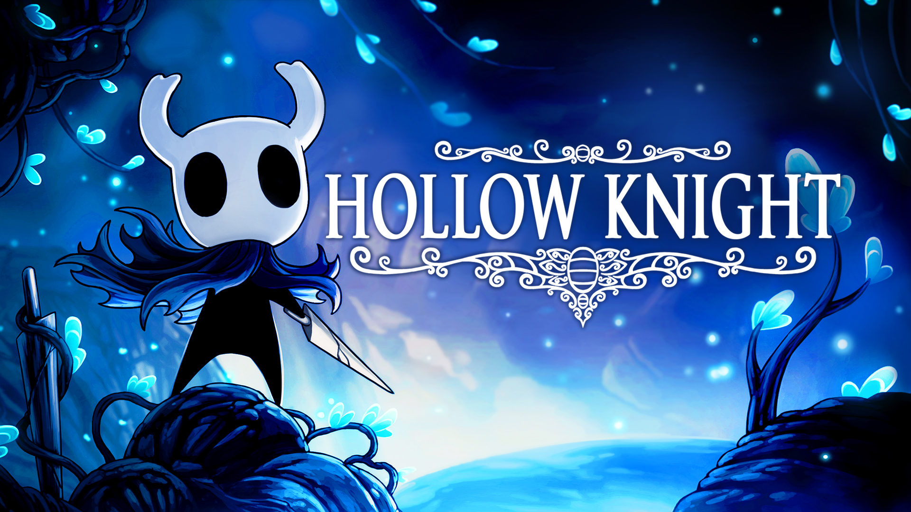
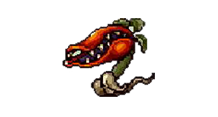
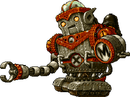
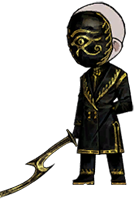
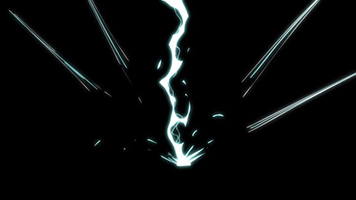
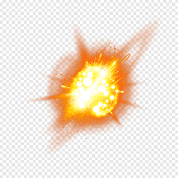

# 프로젝트명: Awake 

# [목차]
## 01. [게임명 : Awake](#1) 
## 02. [컨셉](#2)
## 03. [관련 이미지 & 동영상](#3)
## 04. [대표 이미지](#4)
## 05. [컨셉 & 대표이미지 기반 작품묘사](#5)
## 06. [Awake 구성 요소](#6)
## 07. [게임시스템디자인](#7)
### A. [게임 오브젝트 분해](#7-1)
### B. [파라미터(속성)](#7-2)
### C. [행동](#7-3)
### D. [상태](#7-4)
### E. [플레이어 캐릭터 속성(파라미터)](#7-5)
### F. [게임의 규칙](#7-6)

 

## 08. [개발 요구사항 & 흐름도](#8)
### A. [요구사항(1년/6주)](#8-1)
### B. [시간별 흐름도 flowchart](#8-2)
### C. [키보드 이벤트에 대한 흐름도](#8-3)

 

## 09. [개발작업 일정(6주)](#9)
## 10. [주차별 개발 내용(6주)](#10)
### A. [1주차](#10-1)
### B. [2주차](#10-2)
### C. [3주차](#10-3)
### D. [4주차](#10-4)
### E. [5주차](#10-5)
### F. [6주차](#10-6)

 

# [컨셉] 

## 메인컨셉 : 선택(Select) 

- Player의 선택에 따라 진행 및 결과가 달라짐
- Player의 선택이 필요한 상황을 다양하게 구상 중
- 장르 : 횡 스크롤 2D RPG

 

## 서브 컨셉 1 : 픽셀(Pixel)

- Aseprite를 사용하여 눈에 보이는 모든 사물 및 캐릭터를 픽셀로 구현

 

## 서브 컨셉 2 : 전투(Battle)

- 해당 구역의 모든 적을 처지하지 못하면 다음 구역으로 진입 불가
- 다수의 적을 날려버리는 무쌍 장르 또는 일반 적들도 위협적인 공격을 하는 소울라이크 장르의 전투 방식 중 하나를 선택할 예정

 

## 서브 컨셉 3 : 스킬(Skill)

- Player가 선택할 수 있는 무기가 총 2가지가 있고 무기마다 고유 특성이 다름
- 스킬은 푸른 스킬, 붉은 스킬로 총 2가지가 있고 대략 6 ~ 10개 정도 추가할 예정
- 적을 처치 시 성장 포인트를 획득하고 획득한 포인트로 Player의 성장 또는 스킬을 선택할 수 있음

 

## 서브 컨셉 4 : 스테이지(Stage)

- 총 5 스테이지를 구현할 예정
- 마지막 스테이지를 제외하고 스테이지 당 2가지 구역이 있고 선택해서 원하는 구역 진입 가능
- 스테이지마다 고유한 적과 보스를 배치

 

## 서브 컨셉 5 : 카르마(Karma)

- 스킬 사용 및 특정 적 종류를 처치 시 붉은/푸른 카르마 수치 변동
- 조력자가 원하는 스테이지를 선택 시 해당 스테이지에서 획득하는 카르마 수치 x2
- 붉은 또는 푸른 카르마 중 무엇이 높은지에 따라 엔딩이 변동

  

# [관련 이미지 & 동영상] 

- 이미지  
  
- 동영상
  

  

# [대표 이미지] 

  

# [컨셉 & 대표이미지 기반 작품묘사] 

> ### 대표이미지 기반 :
> 플레이어를 조작하여 플레이어의 HP가 모두 소진되지 않고 적 및 보스들을 모두 소멸시켜야 하는 게임

> ### 컨셉 기반:
> 플레이어가 상대하는 적의 종류, 사용하는 스킬 등으로 얻어지는 카르마 수치로 엔딩이 결정되기에 어떤 스테이지를 선택하고 어떤 스킬을 사용할지 선택하는 재미를 느낄 수 있음 

  

# [Awake 구성 요소] 

- 선택에 따라 엔딩이 바뀌는 2D 횡 스크롤 액션 게임

 

## 1. 메커니즘

### [도전 과제]

1. 당신의 선택으로 미래를 결정하라
2. 당신의 막아서는 적들을 물리쳐라
3. 당신의 능력을 각성하라

 

### [재미 요소]

1. 스테이지 선택, 능력 각성 등 Player의 선택에 따라 엔딩이 달라진다
2. 적들이 다양한 방법으로 Player를 공격한다
3. 스테이지마다 각각의 다른 적과 보스가 출현한다

 

## 2. 이야기

### [만들게 된 배경]  
최근 메트로배니아 장르의 Ori and the Will of the Wisps 게임을 하고 이 장르의 게임들을 알아보다가 Hollow Knight와 ENDER LILIES: Quietus of the Knights라는 게임을 알게 되었다. 그래서 이와 똑같이는 아니더라도 비슷한 게임을 만들어보고 싶었고 기존에 내 상상으로 하던 세계관을 구현해 보자는 생각을 해서 기획하게 되었다.

 

### [카메라 관점]  
2D 횡스크롤 방식으로 카메라는 Player에 고정되어 Player의 움직임에 따라 같이 따라 움직인다

 

### [세계관]  
하늘에 구멍이 뚫리듯 5개의 검푸른 원형 구멍이 뚫려 있는 지구가 아닌 세계.   
그 구멍에서는 미약한 에너지가 계속해서 흘러나왔고 탐사하러 들어갔던 사람들은 모두 돌아오지 못했다.   
탐사 간 사람들이 못 돌아오자 그 구멍은 신과의 연결 통로라고 주장하는 사람들, 봉인해야 된다는 사람들, 연구해야 된다는 사람들 등이 나왔고 같은 생각을 가진 사람들끼리 모여서 구멍을 차지하고 도시를 세웠다.   
그리고 뜻이 다른 도시의 사람들은 서로 전쟁 및 테러가 끝도 없이 발생한다.   
전쟁 및 테러로 가난한 사람들은 도시 외각으로 분포되었고 부유한 사람들은 구멍 쪽으로 분포하여 살게 된다.   한편 연구 도시에 일부 사람들이 초능력자가 되는 현상이 나타났고 도시 내부의 테러가 발생하면서 연구 도시는 혼란에 빠진다.   
연구 도시는 혼란을 해결하기 위해 초능력자들을 제거하기로 하면서 초능력자들은 숨어 살게 된다.

 

### [게임 스토리]  
도시를 수호하는 특수부대에 소속되었던 주인공.  
능력이 발현되면서 모두의 눈을 피해 도망자 삶을 살게 된다.  
주인공이 숨어있던 아지트에 도시 수호군에 쫓기며 들어온 정체불명의 능력자가 우리의 비밀은 구멍에 있다며 자신들의 정체를 밝히자고 반강제적으로 주인공을 데려가면서 시작된다.

 

## 3. 미적요소

### [디자인][컬러]  
- Full 2D 픽셀 그래픽 제작
- 암울한 배경인 만큼 어두운 색감을 사용해서 배경 및 캐릭터를 제작

 

### [음향]  
- 스테이지에 따라 나오는 적의 종류에 맞게 음향은 긴박한 음향, 어둡고 무거운 음향을 사용할 예정

 

## 4. 기술

- Unity 엔진을 이용한 PC 2D 게임으로 개발할

  

# [게임시스템디자인] 

## 1. 게임 오브젝트 분해 

|연번|오브젝트 이름|오브젝트 이미지|
|:----:|:----:|:----:|
|1|Player||
|2|Enemy||
|3|Boss||
|4|NPC||
|5|Player_Skill||
|6|Enemy_Skill||

 

## 2. 파라미터(속성) 

### 1) 오브젝트 이름 : Enemy

|속성|영문 명칭|설명|
|:----:|:----:|:----:| 
|종류|E_Type|Enemy의 종류   0 : 인간형, 1 : 비인간형|
|체력|E_Hp|Enemy의 체력|
|대미지|E_Dmg|Enemy가 Player를 공격할 때 입히는 대미지 수치|
|부여 경험치|E_Exp|Enemy가 소멸될 시 Player에게 부여할 경험치 수치|
|상태이상|E_Con|Enemy가 Player의 공격을 받은 상태   0 : 피격 당하지 않은 상태, 1 : 피격 상태|
|공격 선택|E_Aslt|랜덤으로 주어지는 숫자로 해당 숫자에 맞는 공격을 시전   0 : 일반 공격, 1 : 몸통 박치기, 2 : 공격 미 실시(대기 자세) …|
|이동속도|E_Spd|Enemy의 기본 이동 속도|

 

### 2) 오브젝트 이름 : Boss

|속성|영문 명칭|설명|
|:----:|:----:|:----:|
|종류|B_Type|Boss의 종류   0 : 인간형, 1 : 비인간형|
|체력|B_Hp|Boss의 체력|
|대미지|B_Dmg|Boss가 Player를 공격할 때 입히는 대미지 수치|
|부여 경험치|B_Exp|Boss가 소멸될 시 Player에게 부여할 경험치 수치|
|상태이상|B_Con|Boss가 Player의 공격을 받은 상태   0 : 피격 당하지 않은 상태, 1 : 피격 상태|
|공격 선택|B_Aslt|랜덤으로 주어지는 숫자로 해당 숫자에 맞는 공격을 시전   0 : 일반 공격, 1 : 미사일 발사, 2 : 공격 미 실시(대기 자세) …|
|이동속도|B_Spd|Boss의 기본 이동 속도|
|누적피해|B_Admg|Boss가 Player에게 받은 모든 피해 수치|
|누적 확인|B_ACk|누적피해 수치가 누적확인 수치보다 넘어가면 Boss는 경직 상태로 전환|

 

### 3) 오브젝트 이름 : NPC

|속성|영문 명칭|설명|
|:----:|:----:|:----:|
|대화|is_Click|Player의 마우스 클릭을 확인하는 파라미터   0 : 비 활성화 상태, 1 : 활성화 상태|
|랜덤 답변|N_Ra|랜덤으로 주어진 숫자에 해당하는 대화 확인   0 : 평온한 대화1, 1 : 평온한 대화2, 2 : 평온한 대화3 …|

 

### 4) 오브젝트 이름 : Player_Skill

|속성|영문 명칭|설명|
|:----:|:----:|:----:|
|종류|Ps_Type|카르마 수치를 올려주는 Player skill의 종류   0 : 붉은 카르마, 1 : 푸른 카르마, 2 : 수치 변동 없는 기술|
|대미지|Ps_Dmg|Player skill이 Boss 및 Enemy에게 입히는 대미지 수치|

 

### 5) 오브젝트 이름 : Enemy_Skill

|속성|영문 명칭|설명|
|:----:|:----:|:----:|
|대미지|Es_Dmg|Enemy skill이 Player에게 입히는 대미지 수치|

 

## 3. 행동 

### 1) 오브젝트 이름 : Enemy

|행동|설명|
|:----:|:----:|
|수색|Player 수색|
|이동|Player를 향해 이동|
|공격|Player를 공격 또는 Player에게 스킬 사용|
|피격|Player의 공격을 받고 밀려나며 짧은 시간 동안 무적|
|사망|Player의 공격을 받아 쓰러짐|

 

### 2) 오브젝트 이름 : Boss

|행동|설명|
|:----:|:----:|
|이동|Player를 향해 이동|
|공격|Player를 공격 또는 Player에게 스킬 사용|
|피격|Player의 공격을 받고 짧은 시간 동안 무적|
|경직|Player에게 받은 대미지가 일정 수치 누적되어 무력화|
|사망|Player의 공격을 받아 쓰러짐|

 

### 3) 오브젝트 이름 : Player

|행동|설명|
|:----:|:----:|
|정지|움직임이 없음|
|이동|방향키를 따라 이동|
|점프|위 방향키를 눌러서 점프|
|공격|공격 버튼 ’A’를 눌러서 공격|
|스킬 사용|스킬 버튼 ’1 ~ 5’, ‘q ~ t’를 눌러서 스킬을 사용|
|피격|Enemy 또는 Boss의 공격 및 스킬을 맞고 밀려나며 짧은 시간 동안 무적|
|사망|Enemy 또는 Boss의 공격 및 스킬을 맞고 쓰러짐|

 

## 4. 상태 

### 1) 오브젝트 이름 : Enemy

|현 상태|전이 상태|전이 조건|
|:----:|:----:|:----:|
|수색|이동|수색 범위 내에 Player 진입 확인|
|이동|수색|없음|
|이동|공격|공격 범위 내에 Player 진입 확인|
|공격|이동|Player가 공격 범위에서 벗어남|
|이동 및 공격|피격|Player에게 피격 당함|
|이동 및 공격|사망|Player의 공격을 받아 체력을 모두 소진|
|피격|이동 및 공격|피격 후 무적 시간 해제|

 

### 2) 오브젝트 이름 : Boss

|현 상태|전이 상태|전이 조건|
|:----:|:----:|:----:|
|이동|공격|공격 범위 내에 Player 진입 확인|
|공격|이동|Player가 공격 범위에서 벗어남|
|이동 및 공격|피격|Player에게 피격 당함, 피격 상태로 전이 되어도 이동 및 공격 상태도 계속 유지|
|이동 및 공격|경직|Player에게 받은 대미지가 누적 확인 수치를 넘음|
|이동 및 공격|사망|Player의 공격을 받아 체력을 모두 소진|
|경직|이동 및 공격|일정 시간 후 경직이 해제되고 공격 범위 내에 Player 진입 확인|
|경직|피격|경직 상태 중에 Player에게 피격 당함, 경직 상태는 유지되어 경직 상태가 해제될 때까지 다시 경직 상태로 전이|

 

### 3) 오브젝트 이름 : Player

|현 상태|전이 상태|전이 조건|
|:----:|:----:|:----:|
|정지|이동|방향키로 캐릭터 조작|
|정지|점프|점프 버튼을 조작|
|정지|공격|공격 버튼을 조작|
|정지|스킬 사용|스킬 버튼을 조작|
|정지|피격|Enemy 또는 Boss에게 대미지를 받음|
|정지|사망|Enemy 또는 Boss에게 대미지를 받아 체력을 모두 소진|
|이동|정지|방향키 조작 중 아무 행동을 하지 않음|
|이동|점프|방향키 조작 중 점프 버튼 조작|
|이동|공격|방향키 조작 중 공격 버튼 조작|
|이동|스킬 사용|방향키 조작 중 스킬 버튼 조작|
|이동|피격|방향키 조작 중 Enemy 또는 Boss에게 대미지를 받음|
|이동|사망|방향키 조작 중 Enemy 또는 Boss에게 대미지를 받아 체력을 모두 소진|
|점프|정지|점프 버튼 조작 후 아무 행동을 하지 않음|
|점프|이동|점프 버튼 조작 중 방향키 버튼 조작|
|점프|공격|점프 버튼 조작 중 공격 버튼 조작|
|점프|피격|점프 버튼 조작 중 Enemy 또는 Boss에게 대미지를 받음|
|점프|사망|점프 버튼 조작 중 Enemy 또는 Boss에게 대미지를 받아 체력을 모두 소진|
|공격|정지|공격 버튼 조작 후 아무 행동을 하지 않음|
|공격|이동|공격 버튼 조작 중 방향키 조작|
|공격|점프|공격 버튼 조작 중 점프 버튼 조작|
|공격|스킬 사용|공격 버튼 조작 중 스킬 버튼 조작|
|공격|피격|공격 버튼 조작 중 Enemy 또는 Boss에게 대미지를 받음|
|공격|사망|공격 버튼 조작 중 Enemy 또는 Boss에게 대미지를 받아 체력을 모두 소진|
|스킬 사용|정지|스킬 버튼 조작 후 아무 행동을 하지 않음|
|스킬 사용|이동|스킬 버튼 조작 후 방향키 조작|
|스킬 사용|공격|스킬 버튼 조작 후 공격 버튼 조작|
|스킬 사용|피격|스킬 버튼 조작 중 Enemy 또는 Boss에게 대미지를 받음|
|스킬 사용|사망|스킬 버튼 조작 중 Enemy 또는 Boss에게 대미지를 받아 체력을 모두 소진|
|피격|정지|대미지를 받아 밀려난 후 아무 행동을 하지 않음|
|피격|이동|대미지를 받아 밀려난 후 방향키 조작|
|피격|점프|대미지를 받아 밀려난 후 점프 버튼 조작|
|피격|공격|대미지를 받아 밀려난 후 공격 버튼을 조작|
|피격|공격|대미지를 받아 밀려난 후 공격 버튼을 조작|
|피격|스킬 사용|대미지를 받아 밀려난 후 스킬 버튼 조작|

 

## 5. 플레이어 캐릭터 속성(파라미터) 

|속성|영문 명칭|설명|
|:----:|:----:|:----:|
|무기 종류|P_WPtype|Player의 무기 종류   0 : 중형, 1 : 대형|
|체력|P_Hp|Player의 체력|
|마나|P_Mp|Player의 스킬 사용 시 소모되는 포인트(마나)|
|대미지|P_Dmg|Player가 Enemy 또는 Boss를 공격할 때 입히는 대미지 수치|
|점프력|P_Jump|Player의 점프 높이|
|푸른 카르마|P_BKarma|푸른 카르마 수치|
|붉은 카르마|P_RKarma|붉은 카르마 수치|
|스킬 포인트|P_SkillPoint|스킬 획득 및 스킬 강화, Player 강화에 사용할 포인트|
|스킬 활성화|P_SkillAct(0 ~ 9)|Player의 스킬 활성화 여부   0 : 비활성화, 1 : 활성화, 2 : 강화1, 3 : 강화2…|
|경험치|P_Exp|Player가 Enemy 또는 Boss를 처치하면서 얻은 누적 경험치|
|성장|P_lvUp|경험치 수치가 성장 수치와 같거나 넘어가면 경험치 수치를 0으로 초기화 후 스킬 포인트는 +1|
|상태이상|P_Con|Enemy 또는 Boss의 공격을 받은 상태   0 : 피격 당하지 않은 상태, 1 : 피격 상태|
|이동속도|E_Spd|Player의 기본 이동 속도|

 

## 6. 게임의 규칙 

### 1) 핵심 규칙

- Player의 체력이 0 또는 그 보다 적어지면 사망
- 게임 재시작 전까지 무기 변경 불가
- 스테이지 선택은 Player가 직접 선택
- 획득하지 못한 스킬은 사용 불가
- 스테이지 내의 방에 있는 모든 Enemy를 쓰러트리기 전까지는 다음 방으로 진입 불가

 

### 2) 보조 규칙

- 랜덤으로 지정된 NPC 희망 스테이지를 선택 시 카르마 획득 수치 x2
- 마나가 스킬 사용에 필요한 수치보다 적을 시 사용 불가
- 붉은 카르마와 푸른 카르마 수치 중 큰 카르마에 맞는 엔딩이 등장

 

# [개발 요구사항 & 흐름도] 

## 1. 요구사항(1년/6주) 

### [1] 요구사항 / 1년

### 1) 시작화면

- 게임 제목이 상단에 표기, 그 밑으로 시작 버튼과 종료 버튼
- 제목과 버튼 뒤에 배경으로 게임의 배경이 되는 도시의 풍경

 

### 2) 시작 스토리 및 엔딩

- 시작 화면에서 시작 버튼을 누를 시 첫 시작 방(안전 지역)에서 플레이어 캐릭터와 NPC 캐릭터가 나와서 화면 하단에 네모 형태의 대화 UI가 나와서 짧게 스토리 진행
- 5 스테이지 보스 처치 후 플레이어의 카르마 수치에 따라 마지막 보스 전에 위와 동일하게 스토리가 나오고 최종 보스 처치 후에도 위와 동일하게 스토리가 나옴

 

### 3) 안전 지역(게임 시작 및 보스 처치 후 보스 방)

- 시작 스토리 종료 후 바로 무기 2개에 대한 설명과 선택을 할 수 있는 무기 선택 창이 나오고 해당 창은 앞으로 등장하지 않아 무기를 변경하기 위해서는 처음부터 시작해야 됨
- 각 스테이지 안전 지역마다 NPC, 스토리 오브젝트, 다음 스테이지 선택 오브젝트 각각 1개씩 배치. 각 스테이지 배경에 맞춰서 배치 위치는 다름
-	NPC 클릭 시 NPC 머리 위에 말풍선이 생기면서 랜덤 대사가 나오고 말풍선이 사라진 후 플레이어 능력치 강화 및 스킬 획득/강화 창 열림
-	스토리 오브젝트는 TV 또는 신문지 등 정보를 알리는 물건의 모습을 하고 클릭 시 대화 UI에 세계관 보충 및 현재 진행 중인 스토리에 대한 보충 설명이 나옴
-	스테이지 선택 오브젝트는 문 및 사다리 등의 모양을 한 오브젝트로 클릭 시 플레이어가 진행해야 할 스테이지 안에 2가지 지역에 대한 설명 및 선택이 표시된 창이 열림

 

### 4) 게임 플레이 UI

-	좌측 상단에 막대기 형태의 플레이어 HP 표시 바와 바로 밑에 플레이어 MP 표시 바 배치
-	가운데 상단에 보스 등장 시 보스의 이름과 보스의 HP 표시 바 생성
-	우측 상단에 스테이지에 남아있는 방의 수와 남아있는 적의 수를 표시
-	좌측 하단에 플레이어가 사용할 수 있는 스킬 및 능력 아이콘 표시, 아이콘 밑에 조작키 표시

 

### 5) 게임 플레이

-	HP가 0 또는 0 보다 작아지면 플레이어 캐릭터는 사망
-	MP가 스킬 사용에 필요한 MP보다 적으면 스킬 사용 불가
-	HP 회복 아이템은 스킬 및 능력에 포함되어 각 스테이지 시작 때마다 플레이어가 강화한 최대 보유 개수만큼 아이템 획득 
-	MP는 자동으로 점점 회복되며 회복수치는 스킬 및 능력에 포함되어 플레이어가 강화한 회복수치만큼 자동으로 회복
-	스킬마다 2개의 카르마 수치 중 하나를 올려주며 어떤 수치를 올려주는지는 스킬 아이콘 색상으로 확인 가능
-	화살표 좌우 방향키로 이동, 화살표 위 방향키로 점프, 화살표 아래 방향키로 앉기
-	A로 기본 공격, 1~5/Q~T로 스킬 사용, S~F로 아이템 및 보조 능력 사용
-	적의 종류에 따라 2개의 카르마 중 하나의 카르마 수치가 올라감
-	적은 처음에는 플레이어의 위치를 모르는 상태로 방을 랜덤으로 돌아다님
-	적이 플레이어를 식별 시 추격을 시작하고 추격이 시작되면 플레이어 방향으로 이동, 추격은 거리가 멀어져도 해제불가
-	적이 플레이어에게 가할 공격 및 특수 공격은 적에게 부여되는 랜덤 숫자에 따라 나오며 일정거리가 되면 공격 발동
-	다음 방으로 이동하기 위해서는 방에 있는 모든 적을 처치해야 가능
-	보스는 처음부터 플레이어를 추격하는 추격상태로 시작하고 공격 및 특수 공격은 일반 적과 동일하게 동작
-	보스는 일정 데미지가 누적되면 경직상태가 되어 플레이어 공격에 무방비 상태가 됨
-	보스 처치 시 보스 방은 안전 지역으로 변경

  

### [2] 요구사항 / 6주

### 1) 플레이어 캐릭터

~~1) 플레이어가 할 수 있는 기본적인 행동들은 모두 구현~~

~~2) 스킬 1 ~ 2 가지 구현~~

 

### 2) 적 캐릭터

~~3) 플레이어 수색 및 추격 구현~~

~~4) 공격 및 스킬 구현~~

 

### 3) 맵

~~5) 모든 적을 처치하지 않으면 길을 막는 결계 구현~~

~~6) 적 생성 포인트 구현~~

~~7) 시작 화면에서 씬 전환 구현~~

~~8) 다음 방으로 이동 시 적 및 결계 재생성 구현~~

~~9) 스테이지 클리어 시 씬 전환 구현~~

~~10) 구현한 코드를 모두 실제로 사용할 스테이지로 옮기기~~

 

### 4) UI

~~11) 남아있는 적을 표시하는 UI 구현~~

~~12) 플레이어 HP, MP UI 구현~~

~~13) 남은 방 수를 나타내는 UI 구현~~

~~14) 플레이어 스킬 UI 구현~~

 

## 2. 시간별 흐름도 flowchart 

 

## 3. 키보드 이벤트에 대한 흐름도 

 

# [개발작업 일정(6주)] 

 

# 10. [주차별 개발 내용(6주)] 

## [1주차 작업 목표] 

### 작업명 : 플레이어 캐릭터의 움직임 제작

### 해당 요구사항

1. 애니메이션 : 플레이어의 행동이 자연스러웠으면 한다. (공격 자세 및 부동 자세 등의 애니메이션이 2 ~ 3 가지가 있었으면 한다.)

### 작업 내용

1. 샘플 캐릭터 준비
2. 샘플 캐릭터에 맞게 이동 및 점프, 앉기 구현
3. 실제로 사용할 캐릭터 스프라이트 제작 (이동 스프라이트 8개, 점프 스프라이트 4개, 앉기 스프라이트 8개 제작)
4. 샘플 캐릭터와 사용할 캐릭터를 교체
5. 사용할 캐릭터에 맞게 이동, 점프, 앉기 파라미터 조정

 

### 작업 결과

1. 샘플 캐릭터 준비 (100%)
2. 샘플 캐릭터에 맞게 이동 및 점프, 앉기 구현 (66%)
3. 실제로 사용할 캐릭터 스프라이트 제작 (이동 스프라이트 8개, 점프 스프라이트 4개, 앉기 스프라이트 8개 제작) (66%)
4. 샘플 캐릭터와 사용할 캐릭터를 교체 (0%)
5. 사용할 캐릭터에 맞게 이동, 점프, 앉기 파라미터 조정 (0%)

 

## [2주차 작업 목표] 

### 작업명 : 플레이어 캐릭터 부동 자세 및 공격 자세, 적 캐릭터 움직임 

### 해당 요구사항

1) 애니메이션 : 플레이어의 행동이 자연스러웠으면 한다. (공격 자세 및 부동 자세 등의 애니메이션이 2 ~ 3 가지가 있었으면 한다.)
7) 종류 : 적 캐릭터가 색만 달라졌다고 다른 적 캐릭터가 되는 일이 적었으면 한다.

### 작업 내용

1) 플레이어 캐릭터 부동 자세 스프라이트 제작 (부동 자세 1 스프라이트 4개, 부동 자세 2 스프라이트 4개)
2) 플레이어 캐릭터 공격 자세 스프라이트 제작 (공격 자세 1 스프라이트 6개, 공격 자세 2 스프라이트 6개, 공격 자세 3 스프라이트 6개)
3) 적 캐릭터 이동 스프라이트 제작 (적1 이동 스프라이트 8개, 적2 이동 스프라이트 8개)
4) 플레이어 캐릭터 공격 스크립트 제작
5) 적 캐릭터 이동 스크립트 제작
6) 스토리 확인 및 스테이지 이동에 사용될 상호작용 오브젝트 스프라이트 제작

 

### 작업 결과

1) 플레이어 캐릭터 부동 자세 스프라이트 제작 (부동 자세 1 스프라이트 4개, 부동 자세 2 스프라이트 4개) (100%)
2) 플레이어 캐릭터 공격 자세 스프라이트 제작 (공격 자세 1 스프라이트 6개, 공격 자세 2 스프라이트 6개, 공격 자세 3 스프라이트 6개) (0%)
3) 적 캐릭터 이동 스프라이트 제작 (적1 이동 스프라이트 8개, 적2 이동 스프라이트 8개) (100%)
4) 플레이어 캐릭터 공격 스크립트 제작 (0%)
5) 적 캐릭터 이동 스크립트 제작 (100%)
6) 스토리 확인 및 스테이지 이동에 사용될 상호작용 오브젝트 스프라이트 제작 (0%)

 

### 1차 작업 계획 수정 사유

- 캐릭터 스프라이트 제작에 많은 시간이 소모
- 스프라이트 제작 툴 사용 미숙

 

## [3주차 작업 목표] 

### 작업명 : 씬 이동 / 적 생성 포인트 및 필드 경계 구현

### 해당 요구사항

9) UI 가 눈에 잘 띄었으면 한다

### 작업 내용

1) 게임 시작 화면 구현
2) 시작 버튼을 누를 시 게임 화면으로 이동 구현
3) 필드 안에 적 생성 포인트 구현
4) 적이 남아있을 때 작동하는 필드 경계 구현
5) 남아있는 적 수를 나타내는 UI 구현

 

### 작업 결과

1) 게임 시작 화면 구현 (100%)
2) 시작 버튼을 누를 시 게임 화면으로 이동 구현 (100%)
3) 필드 안에 적 생성 포인트 구현 (100%)
4) 적이 남아있을 때 작동하는 필드 경계 구현 (100%)
5) 남아있는 적 수를 나타내는 UI 구현 (75%)

 

## [4주차 작업 목표] 

### 작업명 : 결계 재생성 / 플레이어와 적의 공격, 피격, 사망 / 플레이어의 HP와 MP를 UI와 연결

### 해당 요구사항

1) 플레이어 캐릭터 : 플레이어가 할 수 있는 기본적인 행동들은 모두 구현 (공격, 피격, 사망)
3) 적 캐릭터 : 플레이어 수색 및 추격 구현
4) 적 캐릭터 : 공격 및 스킬 구현
8) 다음 방으로 이동 시 적 및 결계 재생성 구현
12) 플레이어 HP, MP UI 구현
13) 남은 방 수를 나타내는 UI 구현

### 작업 내용

1) 플레이어 캐릭터, 적 캐릭터의 공격 / 피격 / 사망 구현
2) 결계가 사라지고 다음 방으로 이동 시 결계가 재생성되고 적들이 생성되는 상황 구현
3) 플레이어의 HP, MP UI와 남은 방 수를 나타내는 UI 구현
4) 스테이지 1의 기본 틀 제작

 

### 작업 결과

1) 플레이어 캐릭터, 적 캐릭터의 공격 / 피격 / 사망 구현 (80%)
2) 결계가 사라지고 다음 방으로 이동 시 결계가 재생성되고 적들이 생성되는 상황 구현 (100%)
3) 플레이어의 HP, MP UI와 남은 방 수를 나타내는 UI 구현 (95%)
4) 스테이지 1의 기본 틀 제작 (0%)

 

## [5주차 작업 목표] 

### 작업명 : 플레이어 스킬 및 스킬 UI / 스테이지 클리어 UI 및 씬 전환

### 해당 요구사항

1) 플레이어가 할 수 있는 기본적인 행동들은 모두 구현
2) 스킬 1 ~ 2 가지 구현
4) 적 캐릭터 공격 및 스킬 구현
9) 스테이지 클리어 시 씬 전환 구현
14) 플레이어 스킬 UI 구현

### 작업 내용

1) 플레이어 스킬 UI 및 스킬 구현
2) 스테이지 클리어 UI 및 씬 전환 구현
3) 적 캐릭터 공격 추가 및 Tilemap / 배경 추가

 

### 작업 결과

1) 플레이어 스킬 UI 및 스킬 구현 (100%)
2) 스테이지 클리어 UI 및 씬 전환 구현 (100%)
3) 적 캐릭터 공격 추가 및 Tilemap / 배경 추가 (50%)

 

## [6주차 작업 목표] 

### 작업명 : 사운드 추가 및 UI, 캐릭터 개선

### 해당 요구사항

1) 구현한 코드를 모두 실제로 사용할 스테이지로 옮기기

### 작업 내용

1) 게임 내 사운드 추가
2) UI 폰트 및 이미지 개선
3) 캐릭터 모션 및 AI 개선
4) 스테이지 구성 요소 개선

 

### 작업 결과

1) 게임 내 사운드 추가 (0%)
2) UI 폰트 및 이미지 개선 (70%)
3) 캐릭터 모션 및 AI 개선 (60%)
4) 스테이지 구성 요소 개선 (70%)

