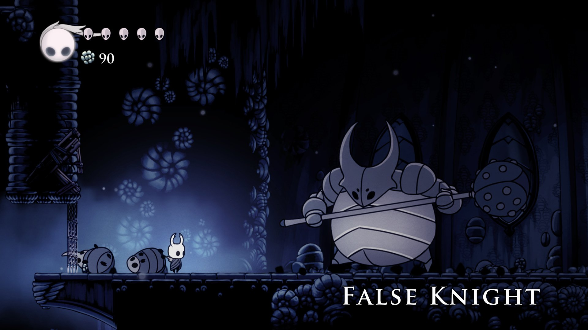

# 프로젝트명: Awake

# [컨셉]

## 메인컨셉 : 선택(Select)

- Player의 선택에 따라 진행 및 결과가 달라짐
- Player의 선택이 필요한 상황을 다양하게 구상 중
- 장르 : 횡 스크롤 2D RPG

### 서브 컨세 1 : 픽셀(Pixel)

- Aseprite를 사용하여 눈에 보이는 모든 사물 및 캐릭터를 픽셀로 구현

### 서브 컨세 2 : 전투(Battle)

- 해당 구역의 모든 적을 처지하지 못하면 다음 구역으로 진입 불가
- 다수의 적을 날려버리는 무쌍 장르의 전투 방식 또는 일반 적들도 위협적인 공격을 하는 소울라이크 장르의 전투 방식 중 하나를 선택할 예정

### 서브 컨세 3 :

- 가나다라마바사아차카타파하 가나다라마바사아차카타파하

### 서브 컨세 4 :

- 가나다라마바사아차카타파하 가나다라마바사아차카타파하

### 서브 컨세 5 :

- 가나다라마바사아차카타파하 가나다라마바사아차카타파하

  

# [관련 이미지 & 동영상]

- 이미지  
  
- 동영상
  

  

# [대표 이미지]

  

# [컨셉 & 대표이미지 기반 작품묘사]

> ### 대표이미지 기반 :

> ### 컨셉 기반:

  

# [<게임제목> 구성 요소]

- 가나다라마바사아차카타파하 가나다라마바사아차카타파하

 

## 1. 메커니즘

[도전 과제]

1. 가나다라마바사아차카타파하
2. 가나다라마바사아차카타파하

[재미 요소]

1. 가나다라마바사아차카타파하
2. 가나다라마바사아차카타파하

 

## 2. 이야기

[만들게 된 배경]  
가나다라마바사아차카타파하 가나다라마바사아차카타파하

[카메라 관점]  
가나다라마바사아차카타파하 가나다라마바사아차카타파하

 

## 3. 미적요소

[디자인][컬러]  
가나다라마바사아차카타파하 가나다라마바사아차카타파하

[음향]  
가나다라마바사아차카타파하 가나다라마바사아차카타파하
 

## 4. 기술

가나다라마바사아차카타파하 가나다라마바사아차카타파하
